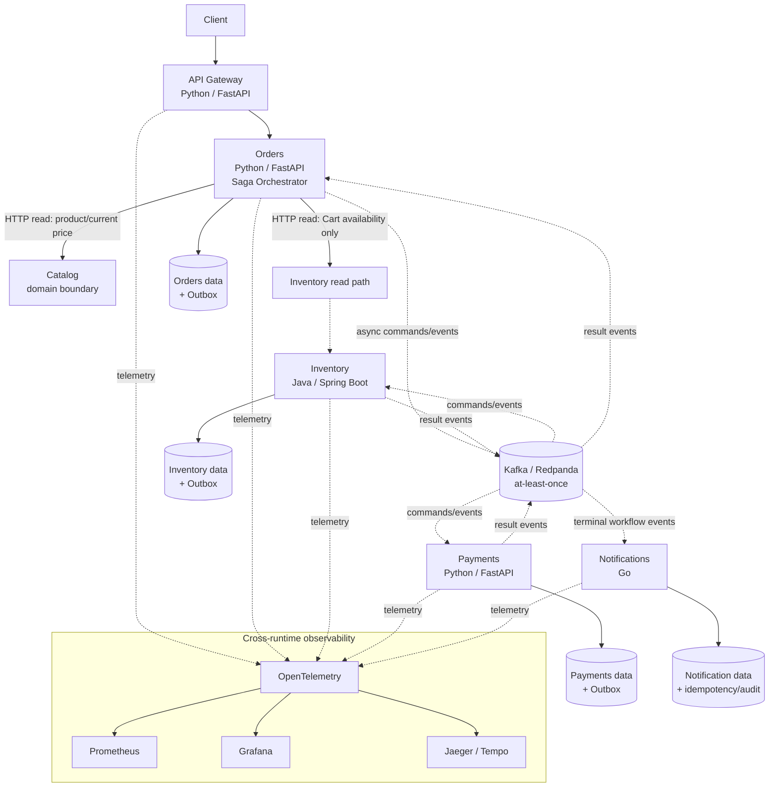

# EventFlow

EventFlow is an educational and portfolio project designed to study
distributed order processing. It deliberately demonstrates asynchronous communication,
eventual consistency, partial failures, idempotency, at-least-once delivery,
Transactional Outbox, Inbox deduplication, Saga compensation, concurrency,
reconciliation, DLQ handling and distributed observability.

Microservices are a deliberate way to expose those problems. This is not a
claim that microservices are better than a modular monolith for this domain.
The trade-off is additional operational and consistency complexity in exchange
for explicit service boundaries and failure modes.

## Current Status

EventFlow is in **Phase 0: architecture and contract preparation**. The
service implementations and local infrastructure are not present yet. The
machine-readable contract baseline now exists under `contracts/`. The documentation describes accepted architectural
decisions and planned behavior; it does not claim those decisions are already
implemented.

## Planned Architecture

Solid arrows represent the client path or immediate reads. Dashed arrows
represent asynchronous workflow messages or telemetry. Each stateful service
owns its own persistence; broker ordering does not enforce the Inventory stock
invariant. Notifications is downstream of workflow events and is not required
for Order Saga completion.

The initial boundaries are:

| Boundary | Technology | Responsibility |
|---|---|---|
| Gateway | Python/FastAPI | HTTP entry, JWT authentication, routing and request/correlation IDs. No business rules. |
| Orders | Python/FastAPI | `Order`, `Cart`, `PriceQuote` acceptance and Saga coordination. |
| Inventory | Java/Spring Boot | Stock, `Reservation`, expiry, release, consumption and concurrency. |
| Payments | Python/FastAPI | Financial state, authorization/capture, compensation and reconciliation. |
| Notifications | Go | Asynchronous event consumer and notification delivery. |
| Catalog | Domain boundary | Product and commercial data, including current price. It does not own physical stock; a separate service is not required yet. |

Each service owns its data. Services do not query or modify one another's
tables. HTTP is used when an immediate response is required; commands and
events coordinate distributed workflows. Orders may aggregate current Catalog
and Inventory data for Cart reads, with safe graceful degradation. Checkout
must validate authoritative preconditions.

## What EventFlow Demonstrates

- Orders orchestrates the Order Saga, but orchestration is asynchronous.
- Inventory is authoritative for Stock and Reservation state.
- Payments is authoritative for financial state and chooses VOID versus REFUND.
- Domain changes and outgoing events use a local Transactional Outbox.
- Delivery is at least once; Inbox deduplication and business idempotency are required.
- `order_id` is the workflow partition key when applicable; broker ordering does not enforce stock integrity.
- Compensation is a new business transaction, not distributed rollback.
- `correlation_id` identifies a business workflow; `trace_id` identifies a technical execution.
- Notifications is a consequence of relevant workflow events; its failure does not reopen or change the Order Saga.

## Planned Technology

The architecture is deliberately polyglot so EventFlow can study
interoperability across runtimes. Python/FastAPI is planned for Gateway,
Orders and Payments; Java/Spring Boot for Inventory; and Go for Notifications.
PostgreSQL, a Kafka-compatible broker/Redpanda, OpenTelemetry, Prometheus and
Grafana are planned infrastructure components. Docker and Kubernetes remain
future infrastructure concerns.

This choice also has costs: multiple toolchains, build and dependency
management practices, test conventions, observability integration and higher
cognitive overhead. Contracts therefore remain language-independent through
OpenAPI, AsyncAPI, JSON Schema and the common event envelope.

## Documentation

- [Documentation index](docs/README.md)
- [Architecture overview](docs/architecture/overview.md)
- [Services and domain boundaries](docs/architecture/services.md)
- [Order workflow](docs/architecture/order-workflow.md)
- [Architecture Decision Records](docs/adr/README.md)
- [Development getting started](docs/development/getting-started.md)

The `contracts/` directory contains the initial OpenAPI, AsyncAPI and JSON
Schema baseline. Service implementations and contract-driven tests remain
future work.

## Future Development Sequence

Architecture and ADRs come first, followed by OpenAPI, AsyncAPI, event schemas,
domain tests, service implementation and infrastructure. Commands such as
`make up` and `make test` are not available until their implementations exist.

## License

This project is licensed under the MIT License. See [LICENSE](LICENSE).
