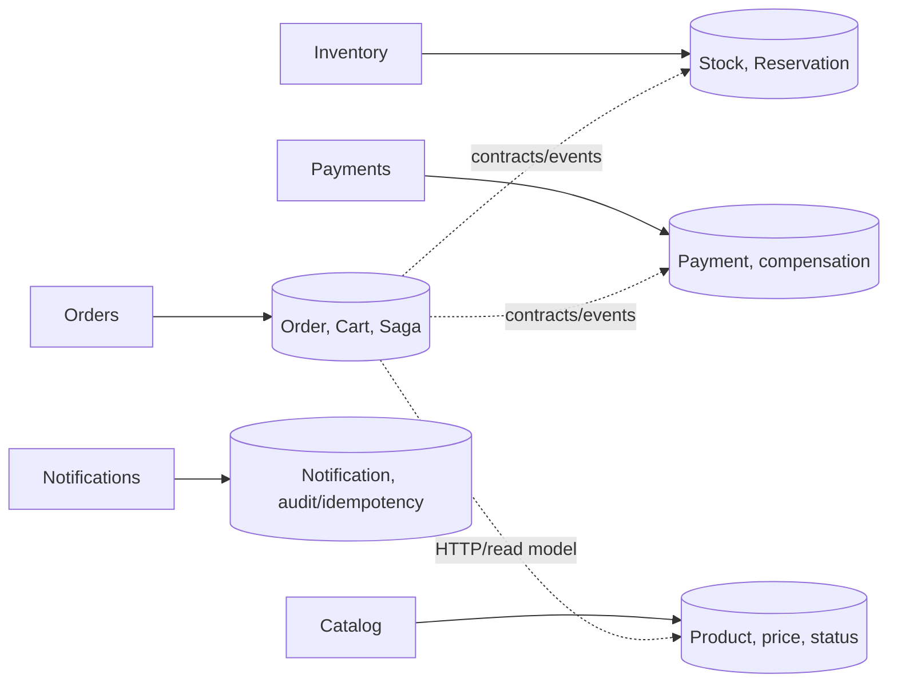

# Data Ownership

Each service is the exclusive owner of its domain data. A service must not
query another service's tables, perform cross-domain joins, or modify another
service's rows. A shared PostgreSQL instance is acceptable only with logical
isolation and separate ownership boundaries.

Services communicate through HTTP contracts when an immediate response is
needed, asynchronous commands/events for workflows, and projections/read
models where justified. These mechanisms carry information; they do not
transfer ownership.

Orders may ask Catalog for current commercial data and Inventory for current
availability while rendering a Cart. Checkout must use authoritative
preconditions, not a stale read. Reconciliation updates a local projection
only when the authority supplies deterministic evidence. Ambiguous evidence is
recorded for investigation, never silently invented.

Notifications owns only its own notification records and the data needed for
deduplication and audit. It has no direct access to Orders, Inventory,
Payments or Catalog databases. An external provider side effect is not made
exactly-once by local ownership; a stable provider idempotency key is used when
the provider supports one.
