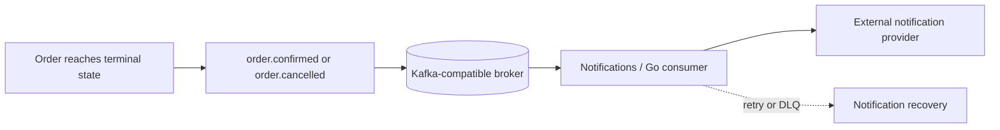

# Order Workflow

## Cart, Quote and Order

Cart is purchase intent. It stores cart identity, SKU and desired quantity; it
does not reserve stock. Its displayed price is informational. A `PriceQuote`
is a time-limited offer containing `quote_id`, `sku`, `unit_price`, `currency`
and `valid_until`. The backend controls validity; browser time and submitted
price are not trusted.

When checkout accepts a valid quote, Orders copies the accepted price into an
immutable `OrderItem` snapshot. A later Catalog price change cannot alter that
Order. A cancelled Order cannot reuse the quote automatically.

Catalog remains the authority for current commercial price and status. The
precise quote issuance and validation contract is intentionally deferred to
contract design; Orders must accept only a backend-valid quote and never trust
a price supplied by the browser.

Cart reads may show `availability: temporarily unavailable` when Inventory is
unreachable. A Catalog timeout must not be presented as `INACTIVE`; technical
failure is not a business state.

## Saga

Orders coordinates the Saga and stores local progress. Conceptual states are
`PENDING`, `STOCK_RESERVED`, `PAYMENT_PROCESSING`, `CONFIRMED`, `CANCELLING`
and `CANCELLED`; the implementation may refine this list.

```mermaid
sequenceDiagram
  participant O as Orders
  participant B as Broker
  participant I as Inventory
  participant P as Payments
  O-)B: reserve command
  B-)I: reserve command
  I-)B: Reservation active or rejected
  B-)O: reservation result
  alt Reservation rejected
    O->>O: cancel without payment
  else Reservation active
    O-)B: payment command
    B-)P: payment command
    P-)B: approved, declined, or unknown
    B-)O: payment result
    alt approved and Reservation valid
      O->>O: CONFIRMED
    else decline or cancellation
      O-)B: release/compensation commands
      B-)I: release command
      B-)P: compensation command when needed
      O->>O: CANCELLING; reconcile and await required effects
      O->>O: CANCELLED only after all required effects complete
    end
  end
```

After a terminal workflow event such as `order.confirmed` or
`order.cancelled`, the broker may deliver the event to Notifications. This is
an asynchronous consequence, not a condition for the Order transition.
Notifications cannot reopen the Saga or change the Order state.

`CONFIRMED` requires an approved payment result and a valid Reservation.
For this workflow, a valid Reservation is an Inventory-authoritative
reservation for the same Order that is still eligible for the required
transition, including its expiry rules. `CANCELLED`
requires the cancellation decision and completion of every mandatory
compensation known for the workflow. An unresolved or ambiguous financial
effect keeps the Order in `CANCELLING`; it is not silently omitted from the
completion decision. `CANCELLING` means the decision is made while effects are
still compensating or being reconciled.

## Reservation and Concurrency

Inventory owns `Reservation(reservation_id, order_id, status, created_at,
expires_at)` and `ReservationItem(reservation_id, sku, quantity)`. States may
include `ACTIVE`, `CONSUMED`, `RELEASED` and `EXPIRED`. Cart never creates a
Reservation.

The exact point at which a successful workflow changes `ACTIVE` to `CONSUMED`
is a future domain/contract detail. It must remain an Inventory-owned atomic
transition and must not allow expiry or release to invalidate a Reservation
that Orders has already accepted as valid for its confirmed transition.

An item request is validated, rejects invalid quantities, groups duplicate
SKUs, sums quantities and updates SKUs in deterministic order in one local
transaction. All items commit or all roll back. The `ACTIVE` to `CONSUMED`
race with `ACTIVE` to `EXPIRED` is decided atomically by Inventory/PostgreSQL.
Local deadlocks may be retried with a bounded retry of the whole transaction.
Kafka does not enforce `available_quantity >= requested_quantity`.

## Payment Ambiguity and Compensation

A timeout is not a decline. Payments may hold `UNKNOWN` or `PROCESSING` while
reconciling with `payment_id`, idempotency key and provider reference. Orders
may cancel its Saga, but Payments must still learn the financial outcome. A
late charge is compensated; it never revives a cancelled Order.

Orders requests financial compensation with a `compensation_id`; Payments,
not Orders, chooses VOID for an authorization or REFUND for a capture (or the
provider-appropriate action). Inventory decides how its Reservation is
released.

## Reconciliation

Normal progress uses events. Reconciliation detects and repairs deterministic
projection divergence, recording evidence, IDs, timestamps and
`correlation_id`. If Payment is `REFUNDED` but Reservation remains `ACTIVE`,
the Order stays `CANCELLING` and reconciliation resumes Inventory release.
Contradictory evidence is recorded and investigated, not silently corrected.

Orders owns workflow reconciliation and may issue idempotent repair commands;
Inventory and Payments alone mutate their authoritative state. Payment
reconciliation remains a Payments responsibility, including provider lookup
and financial compensation.

## Notification Consequence



Notifications assumes at-least-once delivery. A duplicate `event_id` must not
create a duplicate local notification operation. If a provider accepts a
notification before the process records success, redelivery can still cause a
duplicate external side effect unless the provider supports a stable
idempotency key. Exactly-once external notification delivery is not promised.
