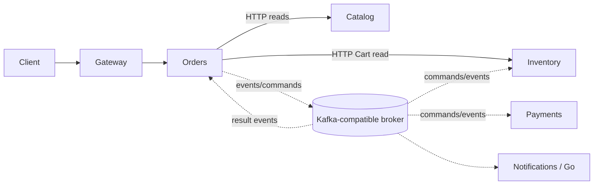

# EventFlow Architecture Overview

## Status

Architecture baseline for Phase 0. The services and infrastructure described
here are planned; this repository does not yet contain their implementations.

## Purpose and Trade-off

EventFlow is an educational and portfolio platform for distributed order
processing. Its purpose is to make asynchronous communication, eventual
consistency, partial failure, idempotency, at-least-once delivery, Outbox,
Inbox, Saga, compensation, concurrency, reconciliation, DLQ and distributed
observability explicit and testable.

Microservices are a deliberate teaching choice, not a claim that they are
better or more scalable than a modular monolith. The cost is operational and
cognitive complexity; the benefit is visible ownership and failure boundaries.

## Service View

The broker and databases are architectural components, not evidence that they
are currently provisioned. Catalog is a domain boundary; a separate Catalog
service is not required yet.

The planned stack is deliberately polyglot: Python/FastAPI for Gateway, Orders
and Payments; Java/Spring Boot for Inventory; and Go for Notifications. This
supports study of interoperability between heterogeneous runtimes, but adds
toolchains, build and dependency management, test conventions and operational
complexity. Contracts and observability remain independent of language.

## Consistency Boundaries

Each service owns its data and changes it only through local transactions. A
shared physical PostgreSQL instance is acceptable in development if logical
ownership is maintained. No service may read another service's tables, join
across domains, or modify another service's data.

Immediate answers use HTTP where necessary. Workflow coordination uses
commands and events. Read models may be used when justified, but the initial
Cart view may call Catalog and Inventory directly and accept temporal coupling.
Read failures may degrade safely; they must not become business states.

## Reliability Model

Domain changes that emit external events use a local Transactional Outbox.
Publishers can republish after a crash, so delivery is at least once rather
than exactly once end to end. Consumers use Inbox/event deduplication and
business operation identifiers. Saga compensation is a new business
transaction, not a distributed rollback.

## Operations and Observability

The planned operational model uses structured logs, metrics and distributed
tracing with OpenTelemetry, Prometheus and Grafana. `correlation_id` follows a
business workflow; `trace_id` follows one technical execution; `span_id`
identifies an operation. Individual IDs belong in logs/traces, not metric
labels.

Operational signals include Outbox pending count and oldest age, publish
failures/retries, consumer lag, DLQ growth and age, Saga age, compensation
failures and reconciliation outcomes. Human alerts are based on impact,
trend, error rate, SLO violation, aging backlog or unresolved financial
compensation, not every isolated exception.

DLQ records preserve the original event, `event_id`, `correlation_id`,
`causation_id`, consumer, attempts, error and timestamps. Reprocessing is
controlled with bounded batches, limited concurrency and backpressure. These
are architecture requirements; no telemetry, broker, alert or recovery tool
is implemented in this repository.

## Related Documents

- [Services](services.md)
- [Data ownership](data-ownership.md)
- [Communication](communication.md)
- [Order workflow](order-workflow.md)
